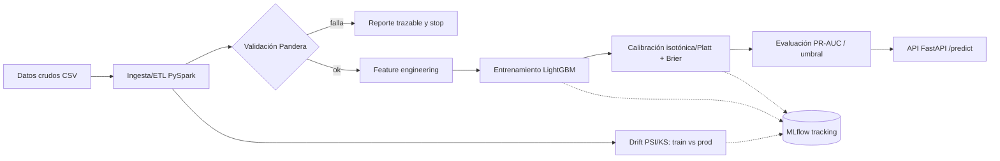

# Pipeline de MLOps de extremo a extremo

> De datos crudos a producción de forma **validada, calibrada y monitoreada**.
> Un núcleo reutilizable que se demuestra sobre tres dominios —banca, salud y
> educación— cambiando solo configuración y esquema, no reescribiendo el pipeline.

[](.github/workflows/ci.yml)


## Pitch

La mayoría de los pipelines fallan en producción no por el modelo, sino por **datos
corruptos** que entran sin avisar o por **degradación silenciosa**. Este proyecto ataca
justo eso con un sello de rigor estadístico:

- **Validación temprana y trazable** (Pandera): si los datos rompen el contrato, fallamos
  antes del modelo, con un reporte claro.
- **Probabilidades calibradas** (isotónica/Platt + **Brier**): el umbral de decisión
  significa algo real (umbral de bloqueo de fraude, umbral clínico, umbral de intervención).
- **Métricas honestas para desbalance**: **PR-AUC** y **Brier**, no accuracy.
- **Monitoreo de drift** (PSI/KS): detección de señales aplicada al propio modelo.

## Arquitectura



## Dominios (mismo núcleo, distinto config + esquema)

| Dominio | Caso | Técnica que luce |
|---|---|---|
| Banca/retail | Fraude transaccional de tarjetas | Probabilidad calibrada para el umbral de bloqueo; PR-AUC por el desbalance |
| Salud | Reingreso / evento adverso | Umbral clínico; **variante bayesiana** con intervalos de incertidumbre |
| Educación | Riesgo de deserción | Probabilidad calibrada para priorizar intervenciones; **drift** entre cohortes |

## Cómo correr

```bash
uv sync                                  # entorno reproducible (Python 3.12 + JDK 21 auto)
bash scripts/download_data.sh            # dataset (Kaggle si hay credenciales; si no, sintético)
uv run python scripts/run_pipeline.py --config configs/fraud.yaml   # ETL→validación→train→drift
uv run pytest                            # 36 tests
```

Servir el modelo como API de inferencia:

```bash
docker compose up                        # API FastAPI (:8000) + MLflow (:5000)
# o sin contenedor:
uv run uvicorn mlops_core.serve.api:app --port 8000
```

```bash
curl -X POST localhost:8000/predict -H "Content-Type: application/json" -d '{
  "trans_date_trans_time":"2020-06-01T12:30:00","amt":125.5,"category":"grocery_pos",
  "gender":"F","state":"CA","city_pop":50000,"lat":37.77,"long":-122.41,
  "merch_lat":37.80,"merch_long":-122.30}'
# → {"probability":0.012,"decision":0,"threshold":0.4167,"domain":"fraud"}
```

## Resultados (dataset sintético 200k, 0.6% fraude)

| Métrica | Valor | Lectura |
|---|---|---|
| ROC-AUC | **0.984** | ranking casi perfecto |
| PR-AUC (calibrado) | **0.37** | ≈60× sobre el azar (prevalencia 0.006) |
| Brier crudo → calibrado | 0.0064 → **0.0043** | la calibración mejora la probabilidad |
| Punto de operación @ precisión objetivo 0.50 | umbral **0.42** · precisión 0.67 · recall 0.22 | knob de negocio en el `config` |

> Métricas reproducibles con `run_pipeline.py`. Cambiarán con el dataset real de Kaggle.
> El umbral se **deriva** de una precisión objetivo: significa algo, no es arbitrario.

## Documentación

El README es la **vitrina**. El "cómo y por qué funciona por dentro" está en `docs/`:

- [`docs/vision-tecnica.md`](docs/vision-tecnica.md) — documento técnico: finalidad,
  arquitectura, etapas paso a paso, decisiones y porqué, ejemplo input→output.
- [`docs/referencia-codigo.md`](docs/referencia-codigo.md) — mapa archivo por archivo
  (propósito, inputs, outputs, dependencias).
- [`docs/glosario.md`](docs/glosario.md) — términos del dominio y técnicos.
- [`CLAUDE.md`](CLAUDE.md) — bitácora de decisiones y convenciones.
