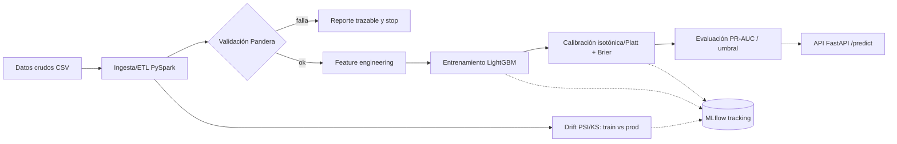

# Pipeline de MLOps de extremo a extremo

> De datos crudos a producción de forma **validada, calibrada y monitoreada**.
> Un núcleo reutilizable que se demuestra sobre tres dominios —banca, salud y
> educación— cambiando solo configuración y esquema, no reescribiendo el pipeline.

[](.github/workflows/ci.yml)


## Pitch

La mayoría de los pipelines fallan en producción no por el modelo, sino por **datos
corruptos** que entran sin avisar o por **degradación silenciosa**. Este proyecto ataca
justo eso con un sello de rigor estadístico:

- **Validación temprana y trazable** (Pandera): si los datos rompen el contrato, fallamos
  antes del modelo, con un reporte claro.
- **Probabilidades calibradas** (isotónica/Platt + **Brier**): el umbral de decisión
  significa algo real (umbral de bloqueo de fraude, umbral clínico, umbral de intervención).
- **Métricas honestas para desbalance**: **PR-AUC** y **Brier**, no accuracy.
- **Monitoreo de drift** (PSI/KS): detección de señales aplicada al propio modelo.

## Arquitectura



## Dominios (mismo núcleo, distinto config + esquema)

| Dominio | Caso | Técnica que luce |
|---|---|---|
| Banca/retail | Fraude transaccional de tarjetas | Probabilidad calibrada para el umbral de bloqueo; PR-AUC por el desbalance |
| Salud | Reingreso / evento adverso | Umbral clínico; **variante bayesiana** con intervalos de incertidumbre |
| Educación | Riesgo de deserción | Probabilidad calibrada para priorizar intervenciones; **drift** entre cohortes |

## Cómo correr

```bash
uv sync                       # entorno reproducible (Python 3.12)
uv run pytest                 # tests
uv run python scripts/run_pipeline.py --config configs/fraud.yaml
```

Con Docker (próximamente, Fase 4):

```bash
docker compose up             # levanta API de inferencia + MLflow
```

## Documentación

El README es la **vitrina**. El "cómo y por qué funciona por dentro" está en `docs/`:

- [`docs/vision-tecnica.md`](docs/vision-tecnica.md) — documento técnico: finalidad,
  arquitectura, etapas paso a paso, decisiones y porqué, ejemplo input→output.
- [`docs/referencia-codigo.md`](docs/referencia-codigo.md) — mapa archivo por archivo
  (propósito, inputs, outputs, dependencias).
- [`docs/glosario.md`](docs/glosario.md) — términos del dominio y técnicos.
- [`CLAUDE.md`](CLAUDE.md) — bitácora de decisiones y convenciones.
