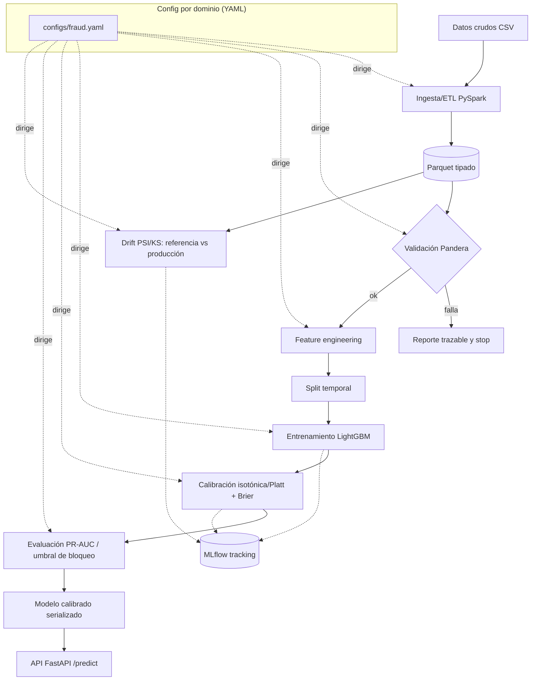

# Visión técnica — Pipeline de MLOps de extremo a extremo

> Este documento explica **cómo y por qué funciona el pipeline por dentro**. El
> [`README`](../README.md) es la vitrina (pitch + cómo usarlo); aquí está el detalle de
> ingeniería. Glosario de términos en [`glosario.md`](glosario.md); mapa archivo por
> archivo en [`referencia-codigo.md`](referencia-codigo.md).

## 1. Finalidad

**Problema.** La mayoría de los modelos no fallan en producción por el algoritmo, sino por
**datos corruptos** que entran sin avisar o por **degradación silenciosa** (la realidad
cambia y el modelo se queda viejo). En entornos auditados (banca, salud, educación) eso es
inaceptable: una decisión sobre un umbral (bloquear una transacción, intervenir a un
paciente o a un estudiante) tiene que ser **trazable, calibrada y monitoreada**.

**Para quién.** Un equipo de datos que necesita llevar un clasificador desde datos crudos
hasta una API de inferencia con garantías de calidad. El núcleo es **reutilizable**: el
mismo pipeline sirve a banca/salud/educación cambiando solo `config` + esquema.

**Sello estadístico (hilo conductor).** Validar antes de entrar, probabilidades
**calibradas** (no solo rankeadas), métricas honestas para desbalance (**PR-AUC**,
**Brier**) y **monitoreo de drift** como detección de señales aplicada al modelo.

## 2. Arquitectura



El `config` (un YAML por dominio) **dirige** cada etapa: qué columnas, cómo partir en el
tiempo, qué umbral de precisión, qué umbrales de drift. El código en `src/mlops_core/` es
**agnóstico al dominio**.

## 3. Procesos y etapas (qué entra, qué ocurre, qué sale)

| # | Etapa | Entra | Ocurre | Sale | Módulo |
|---|---|---|---|---|---|
| 1 | **Ingesta/ETL** | CSV crudo | PySpark lee, tipa columnas y parsea la fecha (escala por volumen) | **Parquet tipado** | `ingest/spark_etl.py` |
| 2 | **Validación** | Parquet (pandas) | Pandera aplica el contrato: tipos, rangos (monto≥0, coords en rango), categorías, label binario | DataFrame validado **o** `DataValidationError` trazable | `validate/runner.py`, `schemas/fraud.py` |
| 3 | **Features** | DataFrame validado | Features de fecha (hora, día, mes) + **distancia haversine** cardholder↔comercio; categóricas a `category` con categorías consistentes train/inferencia | `X` (features), `y` (label) | `features/build.py` |
| 4 | **Split temporal** | `X`, `y` ordenados por tiempo | 70% train / 15% calibración / 15% test (entrenar en el pasado, evaluar en el futuro: evita fuga temporal) | tres particiones | `models/train.py` |
| 5 | **Entrenamiento** | train | LightGBM con `is_unbalance` (tabular desbalanceado: gana a deep learning en costo/explicabilidad) | modelo base + probas crudas | `models/train.py` |
| 6 | **Calibración** | probas crudas en set de calibración | Isotónica y Platt; se elige la de **menor Brier** en test | calibrador ajustado | `models/calibrate.py` |
| 7 | **Evaluación** | probas calibradas en test | PR-AUC, Brier, ROC-AUC, curva de fiabilidad; **umbral** derivado de la precisión objetivo | métricas + umbral de bloqueo | `evaluate/metrics.py` |
| 8 | **Tracking** | params + métricas + artefacto | Se registran en MLflow (reproducibilidad) | corrida MLflow | `models/train.py` (`_log_to_mlflow`) |
| 9 | **Serialización** | base + calibrador + config + categorías + umbral | Se empaquetan en un `CalibratedModel` | `artifacts/<domain>/model.joblib` | `models/calibrated_model.py` |
| 10 | **Drift** | referencia (train) vs producción | PSI por feature + test KS; marca corrimiento según umbrales del config | `DriftReport` | `drift/detector.py` |
| 11 | **Serving** | transacción (JSON) | FastAPI valida (Pydantic), reconstruye features y predice | probabilidad **calibrada** + decisión al umbral | `serve/api.py`, `serve/schemas.py` |

## 4. Decisiones técnicas y su porqué

| Decisión | Elección | Por qué |
|---|---|---|
| Gestor de entorno | **uv** | Rápido, lockfile reproducible, no toca el Python del sistema |
| JDK para Spark | **Temurin 21 a nivel usuario** | Fedora 44 solo trae Java 25/26 (Spark no los soporta). Se aísla `JAVA_HOME` sin tocar el sistema |
| Ingesta | **PySpark** | ETL distribuido; el dataset real (~1.85M filas) lo justifica |
| Validación | **Pandera** | Contrato de datos explícito: fallar temprano y trazable |
| Modelo base | **LightGBM** | En tabular desbalanceado gana a una red en performance/costo/explicabilidad |
| Calibración | **isotónica/Platt elegida por Brier** | El umbral de decisión debe significar algo; se elige objetivamente |
| Métricas | **PR-AUC + Brier** (no accuracy) | Con 0.6% de fraude, accuracy engaña; PR-AUC/Brier son honestas |
| Split | **temporal** | Evita fuga temporal; refleja el uso en producción |
| Umbral | **derivado de precisión objetivo** (knob de negocio) | Operar sobre un umbral con sentido de negocio, no arbitrario |
| Drift | **PSI + KS** | Magnitud (PSI) + test estadístico (KS) son lentes complementarias |
| Serving | **FastAPI + modelo joblib (sin Spark/Java)** | Imagen liviana; la inferencia usa LightGBM+sklearn |
| Datos para correr siempre | **generador sintético con mismo esquema** | Tests/CI/demo sin credenciales de Kaggle; el dataset real entra por `download_data.sh` |

## 5. Ejemplo concreto: input → output

**Entra** (una transacción a `POST /predict`):

```json
{
  "trans_date_trans_time": "2020-06-01T12:30:00",
  "amt": 125.50, "category": "grocery_pos", "gender": "F", "state": "CA",
  "city_pop": 50000, "lat": 37.77, "long": -122.41,
  "merch_lat": 37.80, "merch_long": -122.30
}
```

**Ocurre**: Pydantic valida el contrato → se reconstruyen las features (hora=12, día,
mes, `geo_distance_km`≈12.7) → LightGBM da una proba cruda → el calibrador la corrige.

**Sale**:

```json
{ "probability": 0.0123, "decision": 0, "threshold": 0.4167, "domain": "fraud" }
```

`probability` es **calibrada**: 0.0123 significa ~1.2% de fraude real. Como está por
debajo del umbral (0.4167), la transacción **no se bloquea** (`decision = 0`).

## 6. Cómo correrlo de punta a punta

```bash
uv sync                                   # entorno reproducible (Python 3.12 + JDK 21 auto)
bash scripts/download_data.sh             # dataset (Kaggle si hay credenciales; si no, sintético)
uv run python scripts/run_pipeline.py --config configs/fraud.yaml   # (Fase 5) ETL→...→drift
uv run pytest                             # 35 tests
docker compose up                         # API de inferencia + MLflow  (Fase 4)
```

Verificación esperada: `uv run ruff check` y `pytest` en verde; métricas (PR-AUC, Brier)
en MLflow; `curl POST /predict` devuelve probabilidad calibrada + decisión.

## 7. Aplicabilidad multi-dominio

El mismo núcleo se demuestra sobre tres dominios cambiando `config` + esquema:

- **Banca/retail** — fraude de tarjetas (implementado): probabilidad calibrada para el
  umbral de bloqueo; PR-AUC por el desbalance.
- **Salud** — reingreso/evento adverso: umbral clínico + **variante bayesiana** con
  intervalos de incertidumbre (Fase 6).
- **Educación** — deserción: el **drift** detecta cambios de cohorte año a año (Fase 6).

## 8. Dominios implementados (regla multi-dominio)

| Dominio | Config | Modelo | Dataset | Técnica diferencial |
|---|---|---|---|---|
| **Banca/retail** | `configs/fraud.yaml` | LightGBM + calibración | Sparkov sintético (200k, 0.6% fraude) | PR-AUC, Brier, umbral de bloqueo calibrado |
| **Salud** | `configs/readmission.yaml` | **PyMC bayesiano** | UCI Diabetes 130-US Hospitals (102k, 11% readmisión <30d) | Intervalos creíbles 90%, umbral clínico, IC coverage |
| **Educación** | `configs/dropout.yaml` | LightGBM (misma clase) | UCI Students Dropout (4.4k, 32% deserción) | Drift PSI/KS detecta cambio de cohorte año a año |

Mismo código de modelo/calibración/serving para los tres. La generalización se demuestra
cambiando solo el YAML + el schema Pandera.

## 9. Estado por fases

| Fase | Contenido | Estado |
|---|---|---|
| 0 | Entorno uv, scaffolding, CI, pre-commit, config-driven | ✅ |
| 1 | Ingesta PySpark + validación Pandera | ✅ |
| 2 | Features + LightGBM + calibración + MLflow | ✅ |
| 3 | Drift PSI/KS | ✅ |
| 4 | Serving FastAPI + Docker (Podman en Fedora) | ✅ |
| 5 | Orquestación end-to-end + README profesional | ✅ |
| 6 | Multi-dominio: salud bayesiano (PyMC) + educación (drift de cohorte) | ✅ |
